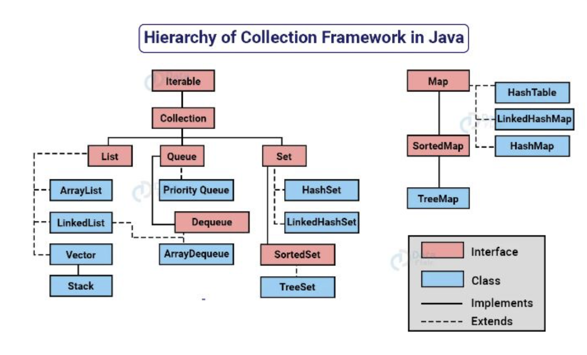

### Определение интерфейса `Set<E>`

#### Концепция множества в Java



**Множество** (Set) в Java — это коллекция, которая не содержит повторяющихся элементов. Интерфейс `Set<E>` является частью Java Collections Framework и расширяет интерфейс `Collection<E>`.

- **Уникальность элементов**: Каждое значение в множестве должно быть уникальным. Если попытаться добавить дублирующий элемент, то операция добавления будет проигнорирована.
- **Отсутствие упорядоченности элементов**: В отличие от некоторых других коллекций, таких как списки (List), множества не гарантируют сохранение порядка элементов.

## Методы интерфейса `Set<E>`

### 1. Добавление элементов (add())
```java
Set<String> set = new HashSet<>();
set.add("Яблоко"); // Добавляем элемент "Яблоко"
set.add("Банан"); // Добавляем элемент "Банан"
set.add("Яблоко"); // Попытка добавить дубликат "Яблоко" (игнорируется)
```

### 2. Удаление элементов (remove())
```java
Set<Integer> set = new HashSet<>(Arrays.asList(1, 2, 3, 4, 5));
boolean removed = set.remove(3); // Удаляем элемент 3, removed = true
boolean notRemoved = set.remove(10); // Попытка удалить отсутствующий элемент 10, notRemoved = false
```

### 3. Проверка наличия элемента (contains())
```java
Set<String> set = new HashSet<>(Arrays.asList("Кошка", "Собака", "Хомяк"));
boolean containsCat = set.contains("Кошка"); // containsCat = true
boolean containsLion = set.contains("Лев"); // containsLion = false
```

### 4. Получение размера множества (size())
```java
Set<Double> set = new HashSet<>();
set.add(3.14);
set.add(2.718);
int size = set.size(); // size = 2
```

### 5. Очистка множества (clear())
```java
Set<Character> set = new HashSet<>(Arrays.asList('A', 'B', 'C', 'D'));
set.clear(); // Очищаем множество
int size = set.size(); // size = 0
```

### 6. Итерация по элементам множества
```java
Set<String> set = new HashSet<>(Arrays.asList("Красный", "Зеленый", "Синий"));

// Использование итератора
Iterator<String> iterator = set.iterator();
while (iterator.hasNext()) {
    String color = iterator.next();
    System.out.println(color);
}

// Использование цикла for-each
for (String color : set) {
    System.out.println(color);
}
```

## Реализации интерфейса `Set<E>`

#### 1. HashSet
HashSet - это реализация интерфейса `Set`, использующая хэш-таблицу для хранения элементов. Основные характеристики:

- **Уникальность элементов**: HashSet не допускает дублирования элементов. При попытке добавления уже существующего элемента операция добавления завершится успешно, но элемент не будет добавлен повторно.
  
- **Порядок элементов**: Порядок элементов в HashSet не гарантируется. Элементы могут храниться в произвольном порядке в зависимости от хэш-кода элементов и их распределения в хэш-таблице.

- **Производительность**: В среднем случае операции добавления, удаления и проверки на наличие элемента в HashSet выполняются за время O(1). Однако в худшем случае время выполнения может быть O(n), где n - количество элементов в HashSet.

#### 2. TreeSet
TreeSet - это реализация интерфейса `SortedSet`, основанная на красно-чёрном дереве. Основные характеристики:

- **Упорядоченность элементов**: TreeSet поддерживает элементы в отсортированном порядке. Сортировка происходит либо в естественном порядке элементов (если элементы реализуют интерфейс Comparable), либо с использованием заданного компаратора (если он указан при создании TreeSet).
  
- **Уникальность элементов**: Как и HashSet, TreeSet не допускает дублирования элементов. При попытке добавления уже существующего элемента операция добавления завершится успешно, но элемент не будет добавлен повторно.

- **Производительность**: Операции добавления, удаления и проверки на наличие элемента в TreeSet выполняются в среднем за время O(log n), где n - количество элементов в TreeSet.

#### 3. LinkedHashSet
LinkedHashSet - это расширение HashSet, которое поддерживает связный список для поддержания порядка вставки элементов. Основные характеристики:

- **Порядок элементов**: LinkedHashSet поддерживает порядок вставки элементов. Это означает, что при переборе множества элементы возвращаются в том порядке, в котором они были добавлены.
  
- **Уникальность элементов**: Как и в случае с HashSet, LinkedHashSet не допускает дублирования элементов.

- **Производительность**: Производительность операций LinkedHashSet такая же, как у HashSet, с тем отличием, что при переборе элементов они возвращаются в порядке вставки.
